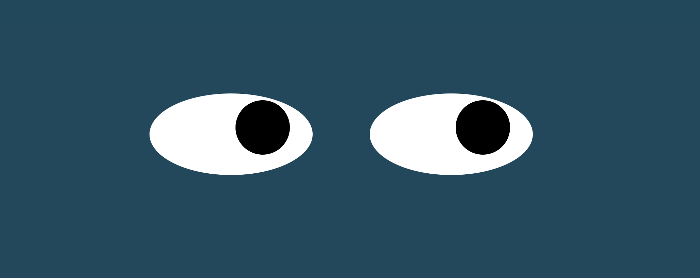
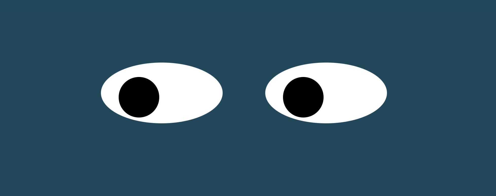
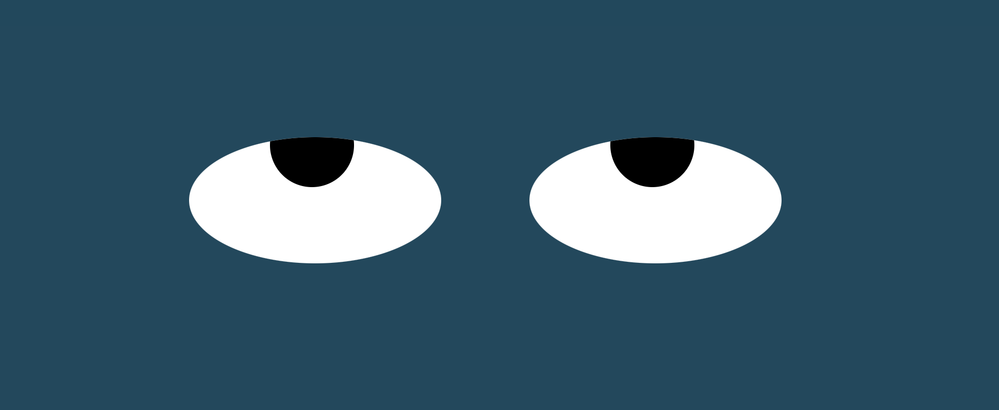

# Eye
In this exercise, 2 eyes are created on the screen, that are then configured to follow the movement of the mouse along the screen. It includes 3 files: Eyes (javascript), Index (html) and Styles (css).

  

 
 

